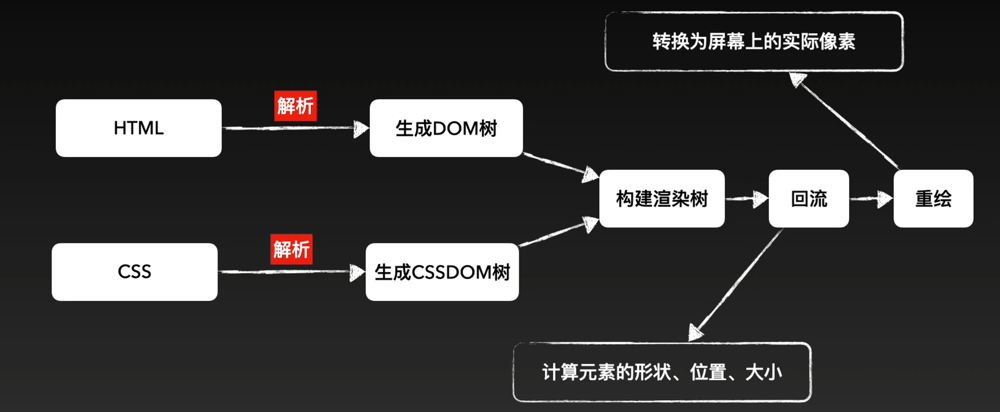
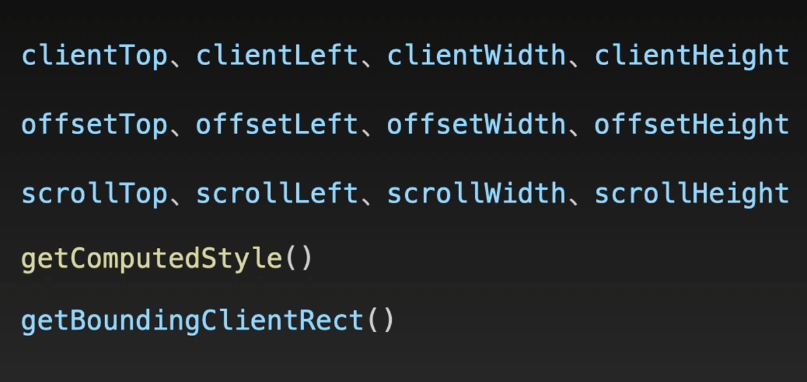
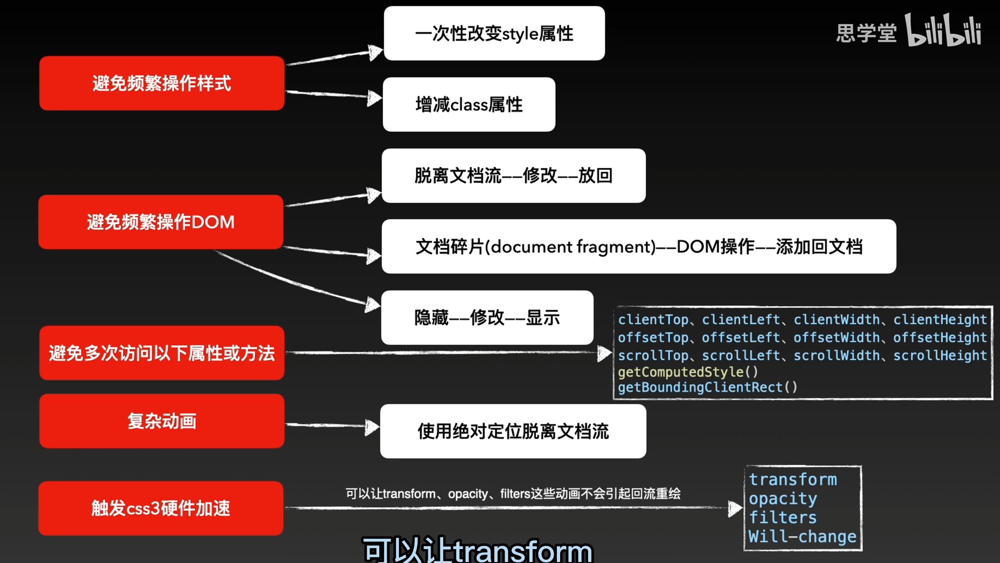

## css面试题汇总

### 介绍一下标准的CSS的盒子模型
>- 标准盒子模型：宽度 = 内容区域（context） + padding + border + margin
>- 低版本IE: 宽度 = 内容区域（context + padding + border）+ margin

### box-sizing 属性是什么
> box-sizing 属性允许您以特定的方式定义匹配某个区域的特定元素。
> - content-box：默认值，内边距和外边距不包含在宽度高度中
> - border-box：内边距和外边距包含在宽度高度中

### 什么是CSS Sprite（“精灵图”）
> - CSS Sprites叫 CSS精灵或者雪碧图，是一种网页图片应用处理方式。
> - CSS Sprites其实就是把网页中一些背景图片整合到一张图片文件中。
>   再利用CSS的"background-image"，“background-repeat”，"background-position"的组合进行背景定位，background-position可以用数字精确的定位出背景图片的位置。

### 使用CSS Sprites的好处
> - 利用CSS Sprites能很好地减少网页的http请求，从而大大的提高页面的性能，这也是CSS Sprites最大的优点，也是其被广泛传播和应用的主要原因
> - CSS Sprites能减少图片的字节，3张图片合并成1张图片的字节总是小于这3张图片的字节总和。
> - 解决了网页设计师在图片命名上的困扰，只需对一张集合的图片上命名就可以了，不需要对每一个小元素进行命名，从而提高了网页的制作效率。
> - 更换风格方便，只需要在一张或少张图片上修改图片的颜色或样式，整个网页的风格就可以改变。维护起来更加方便。

### CSS选择器有哪些？哪些属性可以继承？
> - !important > 内联 > id选择器 > class选择器 > 标签选择器
> - 父子选择器（p1 > p2） 相邻兄弟选择器（p1 + p2） 兄弟选择器（p1 ~ p2） 后代选择器（p1 p2）并集选择器（p1, p2）属性选择器 （.class[p])
> - 可以继承的属性：font-size font-family color
> - 不可继承 border padding margin 等等

### display:none与visibility：hidden的区别？
> - display：none 不显示对应元素，文档布局不会分配空间，不是继承属性，元素及其子元素都会消失。
> - visibility：hidden 隐藏对应元素，在文档布局中仍保留原来的空间，是继承属性，若子元素使用了visibility:visible，则不继承，这个子孙元素又会显现出来。

### CSS中的伪元素是什么？
> - CSS 在渲染文档的时候，伪元素可以通过 css 给 HTML 添加一个元素（叫标签也行），这个元素在文档树中是找不到的。伪元素被当做 CSS 的样式来进行展现，用法和普通的元素用法是一样的。
> - 优点：不占用 DOM 节点，减少 DOM 节点数，避免增加毫无意义的页面元素。
> - 缺点：伪元素不真正在文档内容中体现，只在视觉效果上体现，所以不能给伪元素添加具有实际意义的内容，这部分内容不会搜索引擎抓取。

### CSS允许使用哪些不同的媒介类型
> @media属性主要有四种类型（包括screen）：
> - all—适用于所有设备。
> - print—打印预览模式/打印页面。
> - speech——适用于“朗读”页面的屏幕阅读器
> - screen——计算机屏幕（默认）

###  CSS有哪些单位
> - px：像素。
> - em：相对于父元素或者自身，通过设置父元素，或者自身的font-size改变大小。
> - rem：相对于根元素，通过改变根元素html的font-size改变大小。
> - vh：viewpoint height，视窗高度，1vh=视窗高度的1%。
> - vm：viewpoint width，视窗宽度，1vw=视窗宽度的1%。
> - %：相对父元素。
> - vmin：vw和vh中较小的那个。
> - vmax：vw和vh中较大的那个。

###  浮动（float）
> - 元素同时设置了浮动和绝对定位，则浮动是没有效果。
> - 定位了的元素永远能压住没有定位的元素，即上面的解释：绝对定位能压住浮动的元素
> - 清除浮动（不清除浮动，父元素因为子级元素浮动引起的内部高度为0的问题称为高度塌陷, 如果有不是浮动元素的子元素，浮动元素可能会覆盖掉不是浮动的元素，因为浮动元素脱离了文档流）

### 解决高度塌陷的办法
> 1. 给父元素加高度
> 2. 父元素设置overflow为hidden
> 3. 子元素结尾新增空div设置clear:both
> 4. 在父元素中添加伪元素

### 重绘与回流
> - 重绘是一个元素外观的改变所触发的浏览器行为，例如改变outline、背景色等属性。浏览器会根据元素的新属性重新绘制，
    使元素呈现新的外观。重绘不会带来重新布局，所以并不一定伴随回流。需要注意的是：重绘是以图层为单位，如果图层中某个元素需要重绘，那么整个图层都需要重绘。
    所以为了提高性能，我们应该让这些“变化的东西”拥有一个自己一个图层，
    不过好在绝大多数的浏览器自己会为CSS3动画的节点自动创建图层。
> - 重绘类似装修，如color background-color、visibility等
> - 回流类似造房子，引起添加删除元素，位置，大小，内容，字体等变化的都会触发回流
> - 渲染对象在创建完成并添加到渲染树时，并不包含位置和大小信息。计算这些值的过程称为布局或回流。

> - 以下方法会触发重绘与回流

> - 避免回流

### css图层
> - 浏览器在渲染一个页面时，会将页面分为很多个图层，图层有大有小，每个图层上有一个或多个节点。
    也就是我们各种各样的Dom标签
> - 在渲染DOM的时候，浏览器所做的工作实际上是：
> 1. 获取DOM后分割为多个图层
> 2. 对每个图层的节点计算样式结果 （Recalculate style–样式重计算）
> 3. 为每个节点生成图形和位置 （Layout–布局，重排,回流）
> 4. 将每个节点绘制填充到图层位图中 （Paint–重绘）
> 5. 图层作为纹理上传至GPU
> 6. 组合多个图层到页面上生成最终屏幕图像 （Composite Layers–图层重组）

### Chrome浏览器满足什么条件就会创建图层
> 1. 拥有具有3D变换的CSS属性
> 2. video、canvas、iframe 等元素
> 3. CSS3动画的节点
> 4. 根元素
> 5. position设置了明确值的
